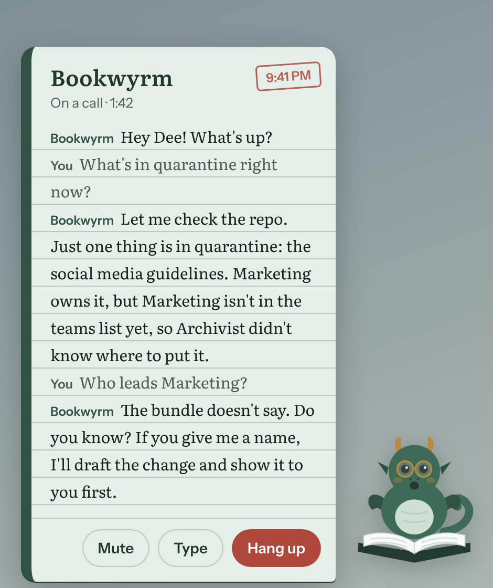
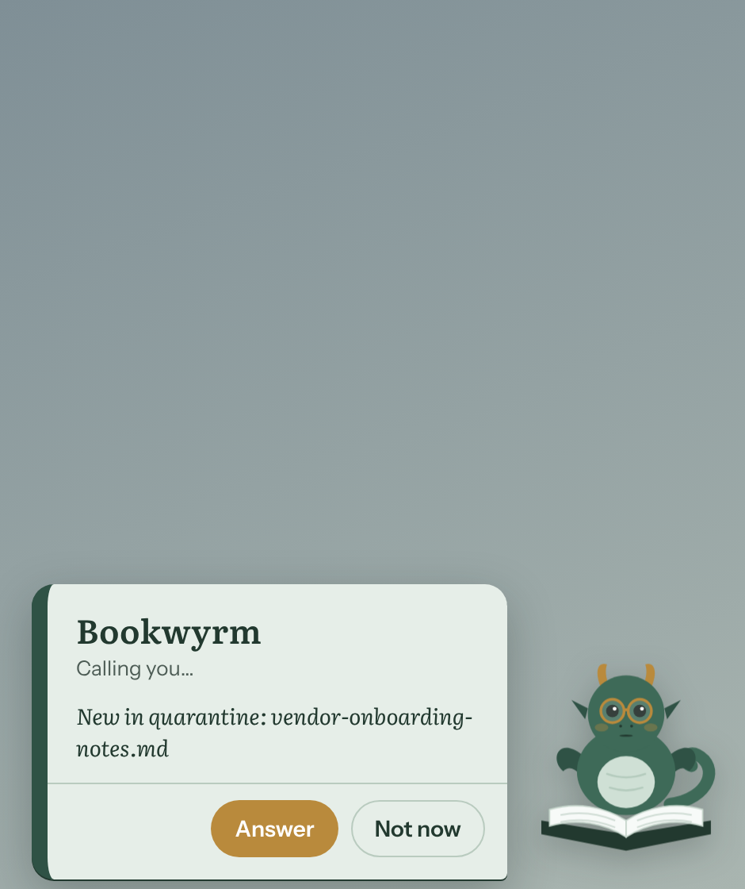

# Bookwyrm

The librarian for [Archivist](https://github.com/dfirmin/archivist) knowledge repos.

Archivist turns messy documents into a curated knowledge bundle in a git repo. Bookwyrm is the
assistant the people who own that bundle talk to — repo owners, SMEs and product owners. It
answers questions from the bundle, takes corrections, helps resolve open gaps and quarantined
drafts, and remembers what it was told so the next person who asks gets the benefit.

Bookwyrm is a **client of Archivist, not part of it.** It never runs the engine and never
writes engine-owned fields. Everything it changes goes to the knowledge repo as a pull request
that a person merges.

## What it does (v0)

| Ask | What Bookwyrm does |
|---|---|
| "What's our policy on X?" | Answers from `index.md` → the concept → its cited sources, and says when a gap is open |
| "That value is wrong, it's 90 days" | Small correction: edits the concept, opens a PR citing who said so |
| "Here's the answer to that gap" | Records the SME's statement as an attributed source document in `sources/inbox/`; the next Archivist run enriches the concept and re-judges the gap |
| "What's stuck in quarantine?" | Reads `okfx_quarantine.needs`, gets the missing contract value from the owner, opens the contract PR, then the requeue PR |
| "Here's the transcript from today's call" | Drops it in `sources/inbox/`; Archivist's extractor (ADR 0006) splits it by topic |

Why SME answers go in as sources rather than straight into the concept: Archivist's rule is
that a concept body restates its sources and adds nothing to them. A source note keeps that
true, keeps who-said-what auditable, and lets the engine's verifier, gap and scoring stages run
on the new content. See [ADR 0002](docs/adr/0002-sme-statements-enter-as-sources.md).

**Call it.** A small book-dragon sits on the edge of your screen. Click it and it rings, picks up
and talks, with a natural voice, live captions, and you can cut in whenever you like. It can also
call *you* when something new lands in quarantine or a new gap is filed (off unless you switch it
on). Speech is heard and spoken on your machine; only text goes to the model. See
[ADR 0003](docs/adr/0003-voice-companion.md).

<p>
  
  
  
</p>

Not yet: the Teams bot, a meeting bot, Postgres memory, and dispatching Archivist runs. Each can
attach later without changing the core (see
[ADR 0001](docs/adr/0001-hermes-runtime-github-tools-sqlite-memory.md)).

## How it's built

- **Runtime:** [Hermes Agent](https://github.com/NousResearch/hermes-agent), as a Hermes
  *profile* named `bookwyrm`. Model-agnostic: direct Anthropic, or any OpenAI-compatible
  endpoint such as a LiteLLM gateway.
- **Tools:** the [GitHub MCP server](https://github.com/github/github-mcp-server), limited to
  reading the repo, branches, file writes, pull requests and issues. No terminal, no local file
  access, no web.
- **Behaviour:** `profile/SOUL.md` (who Bookwyrm is and its hard rules) and the skills in
  `skills/` (one per job above). Shipped skills are read-only to the agent; skills it learns
  on its own land in the profile and are promoted here by pull request.
- **Memory:** Hermes' built-in memory and SQLite session store, per profile.

## Setup

Before you start, have two things ready:

- **An Anthropic API key** ([console.anthropic.com](https://console.anthropic.com/settings/keys)).
- **A fine-grained GitHub token** ([make one](https://github.com/settings/personal-access-tokens/new))
  that can reach *only* the knowledge repo, with Contents, Issues and Pull requests set to
  read and write. The token is the real fence on what Bookwyrm can touch.

Then run one line. **macOS or Linux** (Terminal):

```bash
curl -fsSL https://raw.githubusercontent.com/dfirmin/bookwyrm/main/install.sh | bash
```

**Windows 10/11** (PowerShell):

```powershell
irm https://raw.githubusercontent.com/dfirmin/bookwyrm/main/install.ps1 | iex
```

A setup wizard asks for your name, team, knowledge repo and the two keys (it checks them as you
go), then installs everything with a checklist: Hermes Agent, the GitHub MCP server, the
`bookwyrm` Hermes profile, Hermes' local API, the voice service and its speech models (about
1 GB, once), and the companion app, which it adds to Applications / the Start menu / your app
menu. It fetches Node.js 22 for itself if you don't have it, and keeps Bookwyrm in `~/bookwyrm`
(`BOOKWYRM_DIR` to change). Your settings go to `~/.bookwyrm/settings.json`; the keys only to the
profile's own `.env`.

Run the same line again any time, for example after an update: it skips what's done. From a
clone, `./install.sh` (or `.\install.ps1`) does the same with that clone.

For scripts and CI:

```bash
ANTHROPIC_API_KEY=... GITHUB_PERSONAL_ACCESS_TOKEN=... \
  ./install.sh --yes --name "Dee Firmin" --team "Data Engineering" --repo dfirmin/archivist-knowledge-01
./install.sh --yes --only voice,models,app,launcher     # just some steps
./install.sh --dry-run                                  # show what it would do
```

`./install.sh --help` lists every option and step. One more thing to do yourself: **protect the
knowledge repo's `main`** (require a pull request before merging). Bookwyrm's rules say it only
works through PRs; branch protection is what makes that true.

**Using Bookwyrm.** Open Bookwyrm and click the dragon to call it. Or talk to it in text:
`hermes -p bookwyrm chat`. At startup Hermes may print `Warning: Unknown toolsets: mcp-github`;
that is a start-up ordering message and the tools are there once the server connects
(`hermes -p bookwyrm mcp test github` is the real check, and setup runs it for you).

**Choosing a model:** edit `model:` in `~/.hermes/profiles/bookwyrm/config.yaml`. Direct Anthropic
is the default; a LiteLLM block is there commented out. Setup refreshes that file from
`profile/config.yaml` on every run, so make lasting changes there.

## Layout

```
profile/                 Hermes profile template: config.yaml, SOUL.md, .env.example
skills/                  Bookwyrm's skills (loaded read-only via skills.external_dirs)
voice/                   The call service: Pipecat pipeline, Hermes adapter, local speech models
voice/prompts/           How Bookwyrm talks on a call
app/                     The desktop companion (Electron): the dragon, the ring, the call card
install.sh, install.ps1  One-line installers: get Node.js and the source, start the wizard
setup/                   The setup wizard (Ink): every install step, safe to re-run
docs/adr/                Decisions
docs/live-proof/         What was run and what it showed
```
